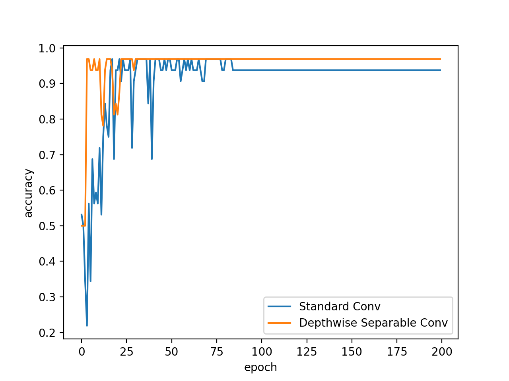

# MaskCheck
MaskCheck 프로젝트는 머신러닝을 이용해 사용자가 마스크를 착용하였는지 판단하는 프로젝트입니다. 
요즘 어느 건물을 들어가도 마스크 착용 여부를 확인하는 기계를 쉽게 볼 수 있습니다. 이 기계를 보고 머신러닝을 배운 저도 손쉽게
만들 수 있지 않을까 싶어 직접 만들어 보았습니다. CNN모델과 SVM모델을 각각 트레이닝하여 두 모델의 결과를 비교해보았습니다.

## 데이터셋 
머신러닝에 관심이 많아 혼자서 이런 저런 프로젝트를 만들어본 경험은 있었지만 데이터셋 구축부터 직접 진행한 것은 이번이
처음이었습니다. 머신러닝의 성능 향상에 가장 중요한 것이 데이터셋의 크기라고 들었지만 대부분의 프로젝트들은 이미 구비된 
충분한 양의 데이터셋을 불러와 학습시키기만 하면 되었기에 크게 와닿지 않았었습니다. 하지만 이번에 직접 데이터셋을 구축해야하면서
양질의 빅데이터를 쌓는 것이 얼마나 큰 가치를 가지는 것인지 알게 되었습니다.

마스크를 끼고 있는 얼굴 사진과 마스크를 벗고 있는 얼굴 사진을 각각 100장 정도 모았습니다. 그냥 구글링을 하면 이런 저런 많은 사진들을
구할 수 있었겠지만 저작권때문에 CCL을 갖는 이미지들로만 필터링을 하니 쉽게 구하기 힘들었습니다. 원본 이미지에서 얼굴부분만 모델에
트레이닝 시키기 위해 얼굴 부분만 Crop하여 데이터셋을 구축하였습니다.

아무래도 dataset의 크기가 많이 작기 때문에 이를 보완하기 위해 augmentation기법을 이용하였습니다. ICLR2020에 나온 AugMix
라는 논문의 방법을 이용하여 augmentation을 하였습니다.

| AugMix | Cascade of successive compositions |
| ------ | ------------ |
|  |    |  

AugMix기법은 간단히 말해 augmentation operation을 직렬로 연결하는 것이 아니라 병렬로 여러 operation을 한 뒤
mix하여 구하는 augmentation 방법입니다. augmentation operation을 직렬이 아닌 병렬로 연결하였기에 원본 이미지에서
크게 벗어나지 않고 원본 이미지와 유사하지만 다른 값을 갖는 새로운 이미지를 얻을 수 있다는 장점이 있습니다. 그리고 논문에서는
모델에 original image를 넣어 얻은 distribution과 augmentation image를 넣어 얻은 distribution이 유사한
분포를 갖게끔 Jensen-Shannon Divergence를 이용한 jsd term을 loss에 덧붙여 주었습니다.

## CNN Model
CNN모델은 VGG모델과 유사한 형태로 구축하였습니다. 3x3 kernel 사이즈를 가지는 conv layer를 여러개 덧붙여 사용하였고
학습을 좀 더 원활히 진행시키기 위해 모든 conv layer뒤에 batch norm을 배치하였습니다. 모델의 특징이라고 하면 standard
conv layer가 아닌 depthwise separable conv layer를 사용하여 모델의 성능은 유지한 채 모델의 전체 파라미터수는 현저히
줄였습니다. 이로 인해 computing resource가 부족한 embedded system에서도 잘 동작하게끔 하였습니다.

|        | Depthwise Separable | Standard |
| ------ | ------------------- | -------- |
| Params | 3M                  | 16M      |

위의 그래프와 표를 보시면 알 수 있듯이, Depthwise Seprable conv를 사용한 결과 파라미터 수가 약 1/5배로 줄었음에도 불구하고 모델의
성능에는 큰 차이가 없음을 알 수 있습니다.

## SVM Model
SVM모델은 scikit-learn에서 제공하는 SVC를 그대로 이용하였습니다. kernel은 linear방식을 사용하였습니다.

## 모델 결과 비교

|      |  CNN  |  SVM  |
| ---- | ----- | ----- |
| Acc  | 0.93  | 0.75  |
 
 
## References

[1] https://arxiv.org/abs/1912.02781

[2] https://m.blog.naver.com/chacagea/221582912200

[3] https://snappygoat.com

[4] https://pixabay.com

[5] https://unsplash.com